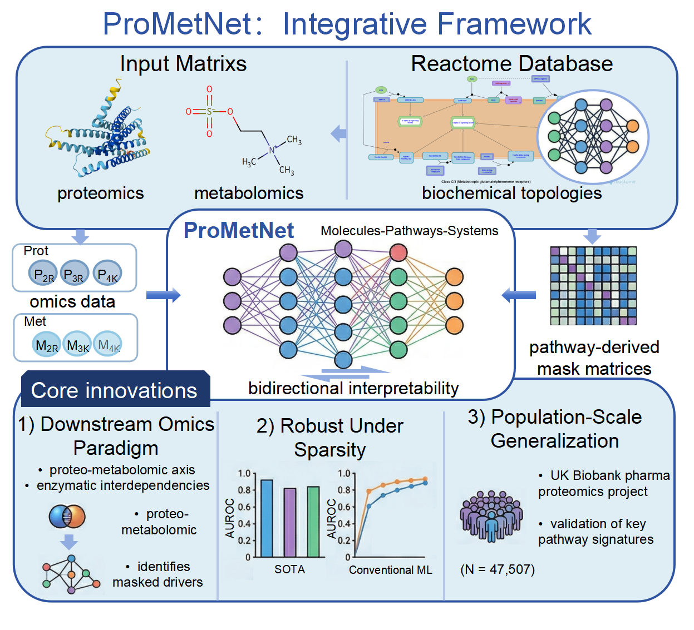
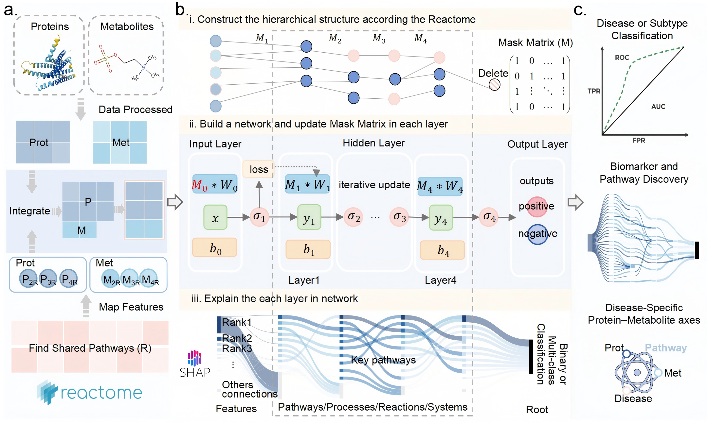
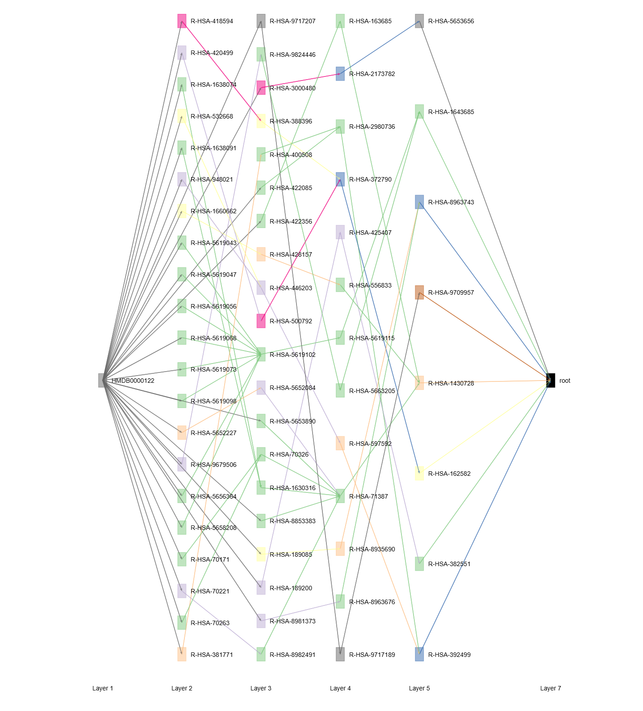
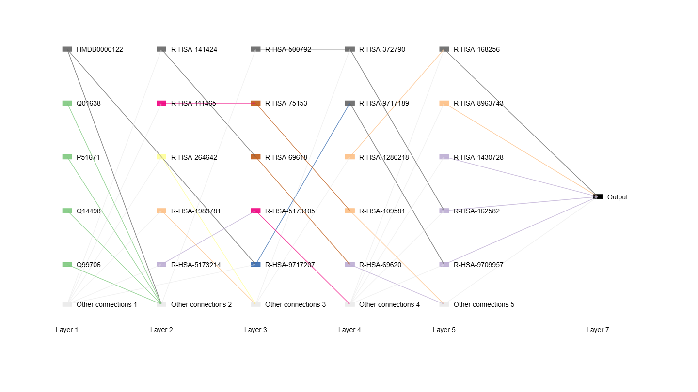

<p align="center">
    
<p>

# ProMetNet: Biochemically constrained multi-omics integration reveals protein–metabolite dependencies across diseases
The ProMetNet framework provides an end-to-end solution for the integration, classification, and mechanistic interpretation of proteo-metabolomic data.

[](https://github.com/InfectionMedicineProteomics/BINN/actions/workflows/pages/pages-build-deployment)
[](https://opensource.org/licenses/MIT)

ProMetNet is a Python-based framework designed to construct pathway-informed sparse neural networks by integrating proteomics and metabolomics data. The provided examples demonstrate how to implement multi-omics integration and automatically generate the underlying network structure by leveraging the [Reactome pathway database](https://reactome.org/) . ProMetNet facilitates model transparency by allowing users to train and interpret the network using [SHAP](https://github.com/slundberg/shap). Additionally, built-in plotting functions support the generation of Sankey diagrams, and other functional visualizations to map molecular signal flow.
The article presenting the ProMetNet can currently be found [here](https://doi.org/10.1002/advs.77067).

<p align="center">
    
<p>

Have a look at the ```ProMetNet_Example.ipynb``` for an example of a complete quick and easy ProMetNet analysis.

---

## Usage

### The consteuct of hierarchical structure
Integrated proteomic and metabolomic datasets are used to construct a Reactome pathway-annotated hierarchical network structure, which acts as the topological scaffold for pathway-constrained sparse neural network architecture design.

```py
from ProMetNet import PathwayGraph
import pandas as pd

input_prot_data = pd.read_csv("./test_data/prot.tsv", sep="\t")
input_meta_data = pd.read_csv("./test_data/meta.tsv", sep="\t")
prot_group = pd.read_csv("./test_data/prot_group.tsv", sep="\t")
meta_group = pd.read_csv("./test_data/meta_group.tsv", sep="\t")

translation = pd.read_csv("./mapping/translations.tsv", sep="\t")
pathways = pd.read_csv("./mapping/pathways.tsv", sep="\t")

network = PathwayGraph(
    input_prot_data=input_prot_data,
    input_meta_data=input_meta_data,
    prot_group=prot_group,
    meta_group=meta_group,
    pathways=pathways,
    mapping=translation,
    input_data_column="Features",
    source_column="child",
    target_column="parent"
)
print(network.get_connectivity_matrices(1))

```
#### Outputs
```py
[             R-HSA-109582  R-HSA-112316  R-HSA-1266738  R-HSA-1430728  \
 HMDB0000036             0             0              0              1   
 HMDB0000067             1             0              1              1   
 HMDB0000070             0             0              0              1   
 HMDB0000097             0             1              0              1   
 HMDB0000122             0             0              0              1   
 ...                   ...           ...            ...            ...   
 Q9UKR3                  0             0              1              0   
 Q9UNA0                  0             0              0              0   
 Q9UNE0                  0             0              0              0   
 Q9Y336                  0             0              0              0   
 Q9Y337                  0             0              1              0   
 
              R-HSA-1474244  R-HSA-1500931  R-HSA-162582  R-HSA-1640170  \
 HMDB0000036              0              0             0              0   
 HMDB0000067              0              0             1              0   
 HMDB0000070              0              0             0              0   
 HMDB0000097              0              0             0              0   
 HMDB0000122              0              0             1              0   
 ...                    ...            ...           ...            ...   
 Q9UKR3                   0              0             0              0   
 Q9UNA0                   1              0             0              0   
 Q9UNE0                   0              0             0              0   
 Q9Y336                   0              0             0              0   
 Q9Y337                   0              0             0              0   
 
              R-HSA-1643685  R-HSA-168256  ...  R-HSA-5357801  R-HSA-5653656  \
 HMDB0000036              1             0  ...              0              0   
 HMDB0000067              1             1  ...              0              1   
 HMDB0000070              0             0  ...              0              0   
 HMDB0000097              1             1  ...              0              0   
 HMDB0000122              1             0  ...              0              1   
 ...                    ...           ...  ...            ...            ...   
 Q9UKR3                   0             0  ...              0              0   
 Q9UNA0                   1             0  ...              0              0   
 Q9UNE0                   0             1  ...              0              0   
 Q9Y336                   0             1  ...              0              0   
 Q9Y337                   0             0  ...              0              0   
 
              R-HSA-73894  R-HSA-74160  R-HSA-8953854  R-HSA-8953897  \
 HMDB0000036            0            0              0              0   
 HMDB0000067            0            0              0              1   
 HMDB0000070            0            0              0              0   
 HMDB0000097            0            0              0              0   
 HMDB0000122            0            0              0              0   
 ...                  ...          ...            ...            ...   
 Q9UKR3                 0            0              0              0   
 Q9UNA0                 0            0              0              0   
 Q9UNE0                 0            0              0              0   
 Q9Y336                 0            0              0              0   
 Q9Y337                 0            0              0              0   
 
              R-HSA-8963743  R-HSA-9612973  R-HSA-9709957  R-HSA-9748784  
 HMDB0000036              1              0              0              0  
 HMDB0000067              1              0              1              0  
 HMDB0000070              0              0              0              0  
 HMDB0000097              0              0              0              0  
 HMDB0000122              1              0              1              0  
 ...                    ...            ...            ...            ...  
 Q9UKR3                   0              0              0              0  
 Q9UNA0                   0              0              0              0  
 Q9UNE0                   0              0              0              0  
 Q9Y336                   0              0              0              0  
 Q9Y337                   0              0              0              0  
 
 [119 rows x 23 columns],
                root
 R-HSA-109582      1
 R-HSA-112316      1
 R-HSA-1266738     1
 R-HSA-1430728     1
 R-HSA-1474244     1
 R-HSA-1500931     1
 R-HSA-162582      1
 R-HSA-1640170     1
 R-HSA-1643685     1
 R-HSA-168256      1
 R-HSA-382551      1
 R-HSA-392499      1
 R-HSA-4839726     1
 R-HSA-5357801     1
 R-HSA-5653656     1
 R-HSA-73894       1
 R-HSA-74160       1
 R-HSA-8953854     1
 R-HSA-8953897     1
 R-HSA-8963743     1
 R-HSA-9612973     1
 R-HSA-9709957     1
 R-HSA-9748784     1]
```

### The building of the neural networks
The ProMetNet can thereafter be generated using the Hierarchy:

```py
from ProMetNet import ProMetNet
prometnet = ProMetNet(
    network=network,
    n_layers=4,
    dropout=0.1,
    validate=True,
    residual=False,
    device="cuda",
    activation='tanh',
    learning_rate=0.001,
    n_outputs=2
)
print(prometnet.layers)
```

#### Outputs
This generates the Pytorch sequential model:

```py
ProMetNet is on the device: cuda:0
Sequential(
  (Layer_0): Linear(in_features=119, out_features=334, bias=True)
  (BatchNorm_0): BatchNorm1d(334, eps=1e-05, momentum=0.1, affine=True, track_running_stats=True)
  (Dropout_0): Dropout(p=0.1, inplace=False)
  (Tanh 0): Tanh()
  (Layer_1): Linear(in_features=334, out_features=208, bias=True)
  (BatchNorm_1): BatchNorm1d(208, eps=1e-05, momentum=0.1, affine=True, track_running_stats=True)
  (Dropout_1): Dropout(p=0.1, inplace=False)
  (Tanh 1): Tanh()
  (Layer_2): Linear(in_features=208, out_features=94, bias=True)
  (BatchNorm_2): BatchNorm1d(94, eps=1e-05, momentum=0.1, affine=True, track_running_stats=True)
  (Dropout_2): Dropout(p=0.1, inplace=False)
  (Tanh 2): Tanh()
  (Layer_3): Linear(in_features=94, out_features=23, bias=True)
  (BatchNorm_3): BatchNorm1d(23, eps=1e-05, momentum=0.1, affine=True, track_running_stats=True)
  (Dropout_3): Dropout(p=0.1, inplace=False)
  (Tanh 3): Tanh()
  (Output layer): Linear(in_features=23, out_features=2, bias=True)
)
```

### Network interpretability and plotting
ProMetNet employs the SHAP algorithm to deconstruct the model's predictions by calculating functional attribution scores for each molecular feature and hierarchical pathway node.

```py
import torch
from ProMetNet import ProMetNetExplainer, ImportanceNetwork

device = torch.device("cuda" if torch.cuda.is_available() else "cpu")
prometnet.to(device)
prometnet.eval()

explainer = ProMetNetExplainer(prometnet)
test_data = torch.Tensor(X)
background_data = torch.Tensor(X)

background_data = background_data.to(device)
test_data = test_data.to(device)

importance_df = explainer.explain(test_data, background_data)

IG = ImportanceNetwork(importance_df, norm_method="DegNorm")

img = IG.plot_complete_sankey(
    show_top_n=5,
    node_cmap='Accent',
    edge_cmap='Accent'
)
img.show()
```
Get explanations of each layer of the network and feature rankings.

Plotting a subgraph starting from a node generates the plot:


A complete sankey may look like this:



### Example input

**Data** - these files should contain a column with the feature names (e.g., an expression/abundance matrix or another input matrix — in this case, "Protein" and "Metabolite"). These features must be mapped to the pathways directly by providing a translation file.

| Features |
|----------|
| Q9UKR3   |
| Q9UNA0   |
| Q9UNE0   |
| Q9Y336   |
| Q9Y337   |

| Features    |
|-------------|
| HMDB0003178 |
| HMDB0006088 |
| HMDB0006293 |
| HMDB0006344 |
...

**Pathways file** - this file should contain the mapping used to create the connectivity in the hidden layers.

| target       | source        |
| ------------ | ------------- |
| R-HSA-9865118 | R-HSA-9916720  |
| R-HSA-9865118 | R-HSA-9916722  |
| R-HSA-991365 | R-HSA-170670 |
| R-HSA-991365 | R-HSA-997272   |
| R-HSA-9917777 | R-HSA-9772755  |
...

**Translation file** - this file is useful if some translation is needed to map the input features to the pathways in the hiddenn layers. In this case, it is used to map proteins (UniProt IDs) to pathways (Reactome IDs).

| input | translation  |
| ------------------- | -------------------------- |
| HMDB0001548          | R-HSA-73843              |
| HMDB0011734          | R-HSA-73843               |
| P30049          | R-HSA-8949613               |
| P30050          | R-HSA-156827               |
| P30050          | R-HSA-156842              |
...

---


## Testing

The software has been tested on desktop machines running Windows 11. Small networks are not RAM-intensive and all experiments have been run comfortably with 16 GB RAM.


<p align="center">
    
    <br>
    <small style="font-size: 4px; color: #666;">Logo generated by artificial intelligence</small>
<p>


## Cite 
Please cite: 

M. Zhao, N. Zhou, R. Liu, et al. “ Biochemically Constrained Multi-Omics Integration Reveals Protein–Metabolite Dependencies Across Diseases.” Advanced Science (2026): e77067. https://doi.org/10.1002/advs.77067

if you use this package.

## Contributors

[Minghui Zhao](https://orcid.org/my-orcid?orcid=0009-0000-8512-0869), Department of Biostatistics, School of Public Health, Cheeloo College of Medicine, Shandong University, Jinan, China

[Qingzhen Hou](https://scholar.google.com/citations?hl=zh-CN&user=agGbyVMAAAAJ), Department of Biostatistics, School of Public Health, Cheeloo College of Medicine, Shandong University, Jinan, China

## Contact

Qingzhen Hou (houqingzhen@sdu.edu.cn)

<p align="center">
    
<p>